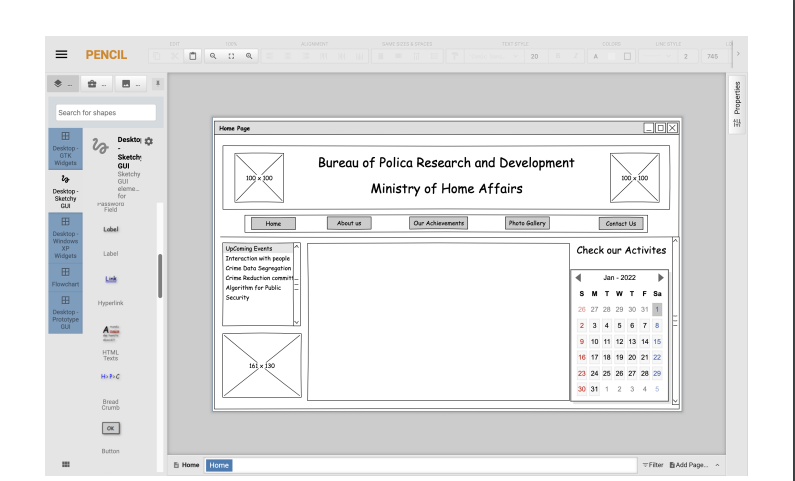
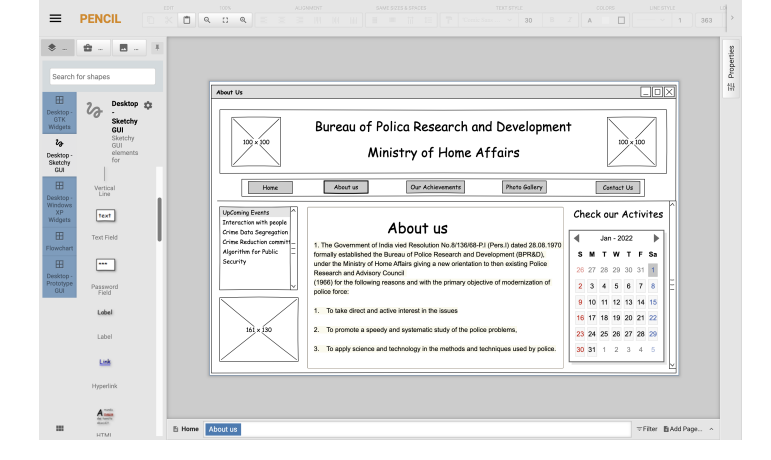
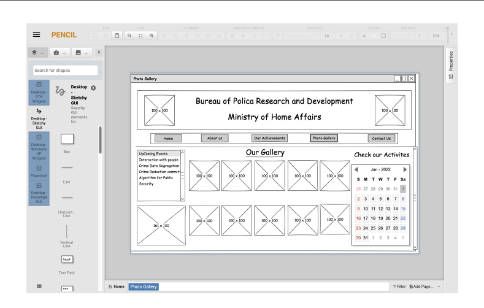

# Wire frame for a website

## AIM:
To design a wire frame for a website.

## DESIGN STEPS:

### step 1:
resize the canvas as per the requirement

### Step 2:
Add a box assuming the head part of the page and logo images in it.

### step 3:
Add box with buttons as a navigation buttons

### step 4:
Add a table and a calender

### step 5:
Add atext for home page and about us page and for photo gallery page add image boxes
### OUTPUT:
> Home page

> About us

> photo gallery

## Result:
Thus a wire frame is designed for a given website.
